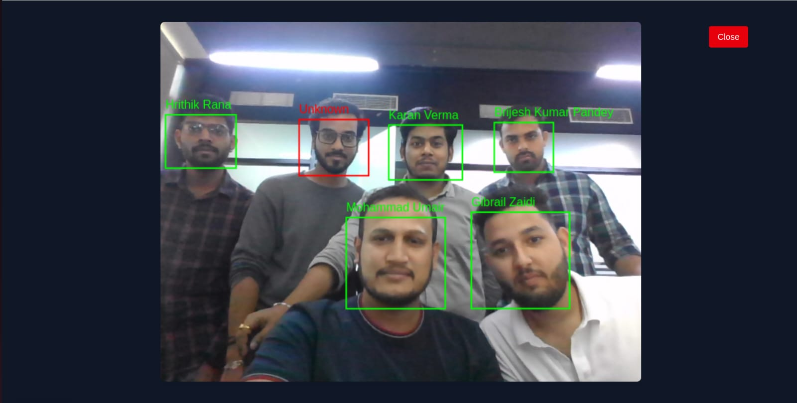

# Face Forward 🕒  

**Face Forward** is a **Face Recognition Based Employee Attendance System** designed for modern workplaces.  
It enables **secure Punch In / Punch Out** using facial recognition, eliminating manual registers, buddy punching, and RFID card misuse.  

This system improves efficiency for both employees and HR departments by automating attendance tracking, ensuring accuracy, and providing real-time analytics.  

---

## 📖 About the Project  

Traditional attendance systems rely on **ID cards, biometric fingerprints, or manual registers** — all of which are prone to errors, delays, and fraud.  

Face Forward solves these problems by:  
- Using **AI-powered face recognition** to authenticate employees.  
- Allowing employees to **Punch In and Punch Out** seamlessly.  
- Maintaining accurate records in **MongoDB** for HR review.  
- Providing **attendance analytics** with visual reports.  

This makes attendance management **contactless, secure, and scalable** for organizations of any size.  

---

## 🏆 Hackathon Project  

This project was built during my **Office Hackathon** 🚀.  
It showcases how **AI + Web Development** can modernize traditional systems and bring real-world impact to workplace management. 

---

## 📸 Screenshot  

  

*(Replace with an actual screenshot of your dashboard/UI)*  

---

## 🌐 Demo  

🔗 [Live Demo](https://face-forward-gibrail-zaidis-projects.vercel.app/)  

---

## 🚀 Key Features  

### 👨‍💼 For Employees  
- Punch In / Punch Out with **Face Recognition**  
- View personal attendance logs  
- Real-time confirmation after punch  

### 🏢 For Admins / HR  
- Dashboard to view all employee attendance  
- Export attendance reports (CSV, Excel, PDF)  
- Detect late arrivals, early exits, and absentees  
- Email alerts/notifications using SendGrid  

### 🔐 Security Features  
- **JWT Authentication** for secure login  
- **Password Hashing** with bcryptjs  
- **Anti-spoofing measures** using `face-api.js + canvas`  

---

## 🏗️ System Architecture  

**1. Client (Frontend)**  
- Built with **React.js + TailwindCSS**  
- Provides Punch In/Out UI  
- Sends captured face data to the server  

**2. Server (Backend)**  
- Built with **Node.js + Express.js**  
- Routes for authentication, attendance logs, admin APIs  
- Handles face recognition logic with `face-api.js`  
- Uses **Nodemailer** for email notifications  

**3. Database (MongoDB)**  
- Stores user profiles (face embeddings, role, department)  
- Stores attendance logs (Punch In, Punch Out, timestamps)  

**4. Reporting & Analytics**  
- Uses **Plotly.js** for data visualization  
- Attendance history, trends, and performance tracking  

---

## 🛠️ Tech Stack  

- **Frontend**: React.js, TailwindCSS  
- **Backend**: Node.js, Express.js  
- **Database**: MongoDB (Mongoose)  
- **Face Recognition**: face-api.js, canvas  
- **Auth**: JWT, bcryptjs  
- **Email**: SendGrid / Nodemailer  
- **Data Viz**: Plotly.js  

---
## 🙌 Thanks To My Teammates  

Big thanks to my amazing teammates who contributed to this hackathon project:  

- [@Hrithikrana377](https://github.com/Hrithikrana377) – Hrithik Rana  
- [@mdumair0](https://github.com/mdumair0) – Mohammad Umair  
- [@JyotiDev95](https://github.com/JyotiDev95) – Jyoti Prakash  

---

## 👨‍💻 Author  

**Gibrail Zaidi**  
📧 Email: gibrailzaidi@gmail.com  
🔗 GitHub: [Gibrail404](https://github.com/Gibrail404)  

---
